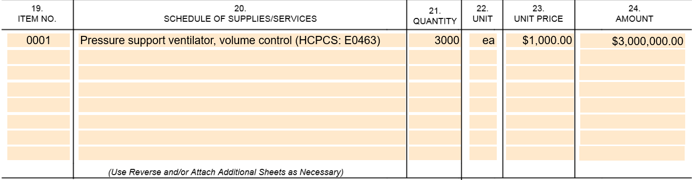

<div class="row box" style="border-color: #f56a6a;">
<div class="1u 2u(small)">
  <span class="icon fa-flag" style="font-size:300%; color: #f56a6a;"></span>
</div>
<div class="10u$ 9u$(small)">
  <strong>Government contracting and acquisition personnel supporting the COVID-19 response should place the HCPCS codes relating to the supplies or services being bought in their respective requests for information, solicitations and contract line items. Government acquisition teams should also instruct vendors to place HCPCS codes in their offers for each CLIN.</strong>
</div>
</div>

## How to include a HCPCS Code within a Contract Line Item (CLIN)

If your contract writing or ordering system allows for adding fields, we suggest you create a separate contract line item field for the HCPCS code. HCPCS codes should be input using all capital letters. If your system does not allow for adding fields, or you are not authorized to do so, we recommend placing the HCPCS directly in the line item description in parentheses using the format `HCPCS: A000` where `A000` is the relevant code:

<span class="image fit"></span>

## How to include a HCPCS Code within an RFI, RFP, or RFQ title

Simply include the HCPCS directly into the title of the RFI, RFP or RFQ using the format `HCPCS: A000` where `A000` is the relevant code.  Example:

```
Request for information pertaining to the manufacture and distribution of Pressure Support Ventilators (HCPCS: E0463)
```

## Why this is important

The inclusion of HCPCS codes within Requests for Information (RFIs), Requests for Proposal (RFPs), Requests for Quote (RFQs) and Contract Line Items (CLINs) will assist in current and future market intelligence efforts for these supplies and services by federal agencies, local governments and commercial entities such as hospital system. We want to ensure that most of the frontline acquisition and logistics personnel in the system are utilizing a uniform taxonomy of product and service codes.

Traditionally government acquisition has relied on product service codes (PSC). PSC codes are not utilized by the Centers for Medicare & Medicaid Services (CMS) for ordering or expenditure tracking. They rely on the same HCPCS system used for billing to process orders for supply and services related to their activities. These codes can also be used to forecast demand using a common taxonomy. For example, most durable medical equipment codes are not tracked under PSC Code 6510 or 6515 but mostly fall under a variety of HCPCS E codes.


